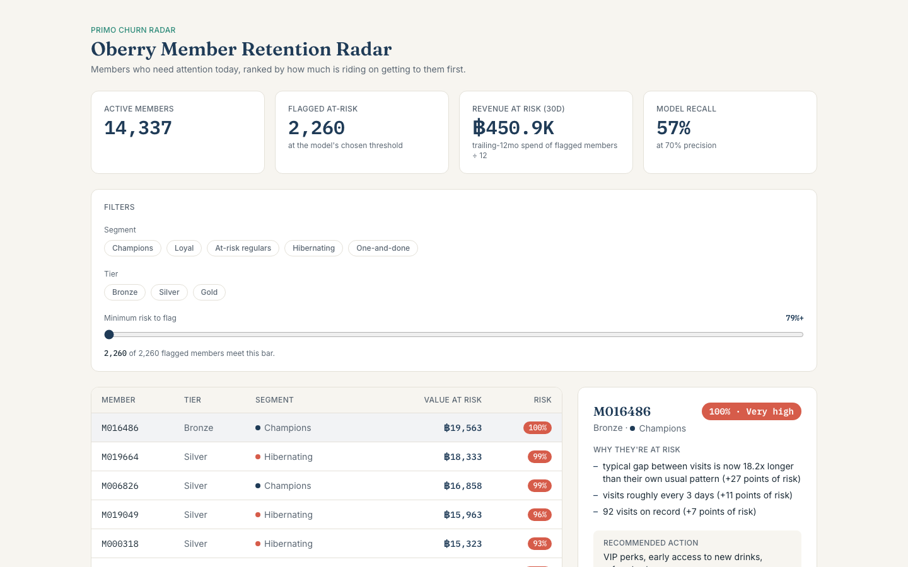

# primo-churn — Oberry Member Retention Radar

A churn-prediction and member-segmentation engine for loyalty programs, built for **PRIMO** (an AI loyalty & CRM platform) and demonstrated on **Oberry**, a fictional Thai café chain.

## Live demo

- **Project page:** [primo-churn-pi.vercel.app](https://primo-churn-pi.vercel.app/)
- **Dashboard:** [primo-churn-pi.vercel.app/dashboard](https://primo-churn-pi.vercel.app/dashboard) — the "Oberry Member Retention Radar," bilingual (Thai default, English switchable)



## ⚠️ All data is synthetic

Oberry is a fictional café chain. Every member, transaction, and figure in this repo — the dataset, the dashboard, the executive deck — is generated data, not a real business's numbers. Nothing here is a forecast. This distinction matters enough to say twice: **illustrative, not predictive.**

## The problem

A loyalty-program member who quietly stops coming back rarely announces it — no cancellation, no complaint, nothing that trips an alarm in a typical point-of-sale report. By the time an operator notices, winning that member back is far more expensive than it would have been to reach out while they were merely drifting.

**Churn definition:** no transaction for **60 consecutive days**. Oberry's regulars visit weekly, so 60 days of silence is a genuine departure, not a holiday.

## Method

```
generate synthetic data → engineer features → K-means segmentation
    → logistic-regression baseline → XGBoost → SHAP explanations → recommendation layer
```

1. **Feature engineering** (`src/features.py`) — collapses two years of transactions into one row per member as of a fixed cutoff date: recency, frequency, monetary, tenure, branch loyalty, redemption behavior, and visit-gap trend.
2. **K-means segmentation** (`src/segment.py`) — clusters members on RFM into five behavioral segments (Champions, Loyal, At-risk regulars, Hibernating, One-and-done), named from each cluster's own profile rather than a hardcoded cluster index.
3. **Logistic regression** — a scaled, class-weighted baseline model. Landing respectably close to XGBoost is treated as a useful finding about how strong the raw signal is, not a failure to beat.
4. **XGBoost** — tuned via `RandomizedSearchCV`, weighted for the class imbalance.
5. **SHAP** (`src/explain.py`) — explains individual predictions as plain-English sentences ("68 days since last visit"), not raw feature importances.
6. **Recommendation layer** (`src/recommend.py`) — maps each flagged member's segment to a specific campaign, ranked by estimated annual value at risk, not by risk percentage alone.

Three tiers, one hard boundary: Python runs the pipeline offline and pushes results into Supabase; the Next.js app on Vercel only ever reads from Supabase — it never runs Python or loads a model.

```
Python (local, batch) ──push──▶ Supabase (Postgres) ──read──▶ Next.js on Vercel
```

## Results

At 19.3% churn in the test set, accuracy is a trap: a model that predicts "nobody leaves" scores **80.7% accuracy** while catching **zero** actual churners. That's the baseline every number below has to beat, not 0%.

| | Accuracy | Precision | Recall | ROC-AUC | PR-AUC |
|---|---|---|---|---|---|
| **Majority-class baseline** (predicts "stays," always) | 80.7% | 0.0% | 0.0% | 0.500 | 0.193 |
| **Logistic regression** | — | — | — | 0.827 | 0.553 |
| **XGBoost** | — | — | — | 0.891 | 0.700 |

*(Precision/recall/accuracy weren't persisted for the two trained models at a fixed threshold — only ROC-AUC/PR-AUC, which don't depend on picking one. XGBoost's precision/recall below are at its deliberately chosen threshold instead.)*

**At the chosen operating point** (threshold 0.79, chosen to maximize recall subject to precision ≥ 70% — missing a departing member costs more than a wasted coupon): XGBoost catches **57.2%** of members who actually churn, at **70.0%** precision on every alarm it raises.

|  |  |
|---|---|
| Total members | 20,000 |
| Scored (test set) | 14,337 |
| Flagged at-risk | 2,260 |
| Est. annual value at risk | ฿5,410,593 |
| Caught churn / missed churn / false alarm / true stay | 1,582 / 1,183 / 678 / 10,894 |

## Methodology notes

**Time-based split, not a random one.** Features are built at one cutoff (2026-01-31 for training, 2026-04-30 for testing) and labeled using the 60 days *after* that cutoff — never `train_test_split(shuffle=True)`. A random split lets the future leak into the past and produces a fake ROC-AUC near 0.99; a time-based split is what a production system actually faces (score today, find out in 60 days who was right). `src/features.py` asserts explicitly that no feature touches data after its cutoff, and fails loudly if that's ever violated.

**Why the baseline stays in the report.** At 19–28% churn, accuracy alone is meaningless — see the table above. Every result here is reported alongside the trivial baseline on purpose, not as a footnote.

**Leakage check.** If XGBoost's ROC-AUC had exceeded 0.95, `src/model.py` is written to stop and raise rather than silently ship a suspiciously-good model — that threshold is a real code path, not just a comment.

## How to run it locally

```bash
git clone https://github.com/tundeeorg-cmd/primo-churn.git
cd primo-churn
uv sync                              # Python deps (uv, https://docs.astral.sh/uv/)
cp .env.example .env                 # fill in SUPABASE_URL / SUPABASE_SERVICE_KEY
make all                             # data → features → segment → train → evaluate → explain → recommend → push
```

Individual pipeline steps are also available as their own `make` targets (`make data`, `make features`, `make segment`, `make train`, `make evaluate`, `make explain`, `make recommend`, `make push`, `make deck`).

For the web app:

```bash
cd web
npm install
cp ../.env.example .env.local        # fill in the two NEXT_PUBLIC_ vars
npm run dev                          # http://localhost:3000
```

`supabase/schema.sql` needs to be run in the Supabase SQL editor before `make push` will have anywhere to write.

## Tech stack

- **Python 3.12**, managed with [uv](https://docs.astral.sh/uv/)
- **pandas** / **numpy** — data wrangling
- **scikit-learn** / **xgboost** — modeling
- **shap** — model explainability
- **matplotlib** — static plots
- **python-pptx** — executive-deck export
- **jupyter** — exploratory notebooks
- **Supabase** (Postgres) — scored results, read-only to the browser via Row Level Security
- **Next.js** (TypeScript, Tailwind, App Router), deployed on **Vercel** — the public project page and the Oberry Member Retention Radar dashboard

## Repo structure

```
primo-churn/
├── README.md            this file
├── PROJECT_BRIEF.md      the original build brief / prompt pack the project was built from
├── data/{raw,processed}/ generated CSVs (raw is gitignored — regenerates deterministically, seed 42)
├── src/                  the pipeline: generate_data → features → segment → model → evaluate → explain → recommend → push_to_supabase → build_deck
├── supabase/schema.sql   the five-table schema, RLS read-only to `anon`
├── notebooks/            exploratory analysis
├── outputs/               figures, trained models (gitignored), metrics.json, the executive deck
├── web/                   Next.js app (project page + dashboard), deployed to Vercel
└── docs/archive/          superseded docs
```

## Author + license

Built by **Jenissa Vichiansin** — International School Bangkok.

MIT License — see [LICENSE](LICENSE).
